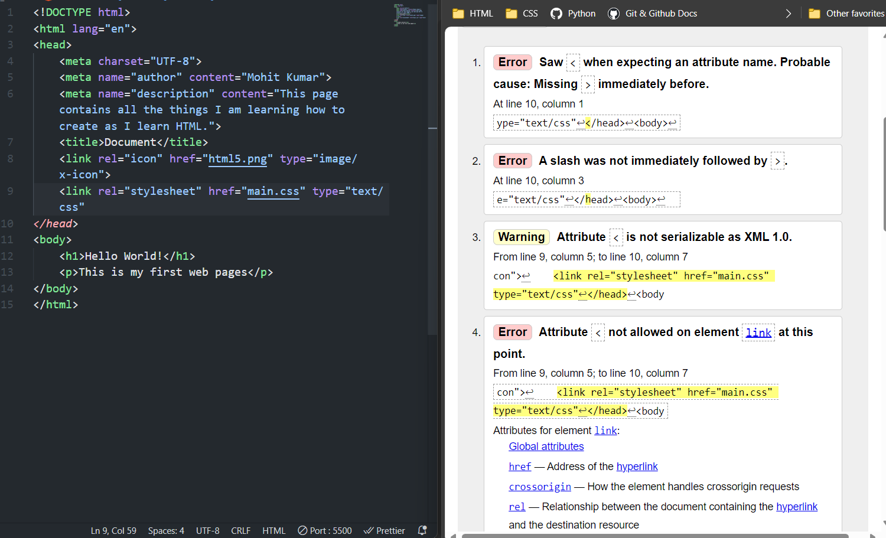

# HTML
## 02 HEAD
- some meta tags decribe the web page little bit more detail than possibly 
- We can store more metadata inside the head element 
- we have added more description about our page this information could be picked up in a search engine or some other service that wants to learn more about our web page

### link rel attribute
- rel stands for relation 
- how does this relate to the web page
- link rel = "icon"
- link rel = "stylesheet"

### href attribute
- href stands for hypertext refrence
- we referencing a resource like file or link 

### type attribute
- what type of resource is this 
- type = "image/x-icon"

### favicon 

```
    <link rel="icon" href="html5.png" type="image/x-icon">

    <!-- This is the same area where we would link to css file and even javascript file and other resources that we pull in from the web   -->

    <link rel="stylesheet" href="main.css" type="text/css">

    <!-- here type is not required anymore our browser should know what it is even if we didn't add that at this point because that's really the only type of stylesheet -->
```

### Mistake

```
  <link rel="stylesheet" href="main.css" type="text/css"
</head>

 created several errors on the page just by leaving out that one closing greater than symbol for the link tag
``` 
