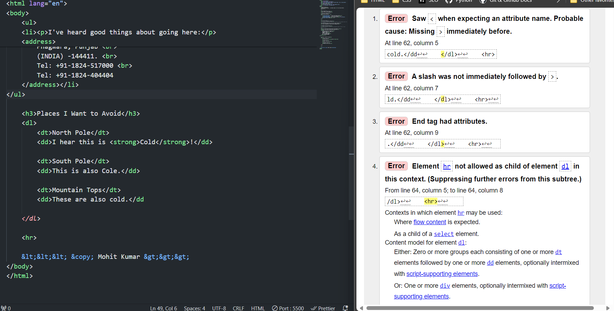

# HTML
## LISTS
- There three types of Lists in HTML:
    - Ordered List
    - Unordered List
    - Discription List
- list is not creating that extra space like that a paragraph
- We nested the paragraph inside the li (list items)
- address and paragraph both them nested in one li (list items)
- ordered list and our unordered list are both indented compared to being over here flushed to the left
- similar in formatting from an ordered list to an unordered list 
- description list has a different format than the ordered list and the unordered list
 
### Ordered List
- By defalut 1 , 2, 3, 4 ....
- li 
### Unordered List 
- by default bullet point •
- li 

### Discription List 
- Inside the discription list there are two different types of items 
    - dt - discription term
    - dd - discription list
- our description term is to the left and then the description details are indented to the right
- but here is our full list of the north pole south pole and mountain tops

## Error
- one error can create a cascade or a lot of errors
- one small syntax error that creates a cascade of errors when 
-  it's always a good idea to validate your code
- after you write it to make sure you don't have any syntax errors
