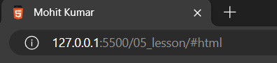

# HTML 
## Add Links
## LINK tag
- hypertext  it's what links together everything on the web
- it's really what makes the web work so well think about spider-man or really any type of spider that's throwing out strands of web and linking things together that's essentially what we're doing when we create hypertext links we're linking the web together 
- link tags that we created in the head part of the page and these link tags are pulling in resources from other parts of the web whether it's something we have on our server
- web page like this fav icon or we could **pull in something from another part of the web like a font from google fonts**
- it's possible with the link tag but **that's not what we use to link pages to each other**
## Anchor tag
### absolute refrences
- anchor tag that will create a link to another page on the web 
- https://developer.mozilla.org/en-US
    - here en-US - it will default to the browser choice that gives the specific language for the site
-  purple means a visited link if you have not visited that site it's probably more like a royal blue or a bright blue color and that means it's not visited yet and those are the default colors for links
- full address to that website and it's a specific address this is what you would call an **absolute reference** this has the full address for the web page to where we're going

## Relative References
```
<link rel="icon" href="html5.png" type="image/x-icon">
<link rel="stylesheet" href="main.css" type="text/css">

<a href="about.html">Mohit Kumar</a>
```
- when we link to something that's already on the same server as our page where we're hosting our website is **Relative References**
- Here anchor tag is **Relative References** because Here's we linked pages that's on the same server and folder

## Internal References
- link to an area on the same page on the page
- we can create shortcuts to different areas of the page 
-  if we click learning html on the page it goes ahead and scrolls the page directly up to the i'm ready to learn html section

## Section 
```
<section> </section>
```
- we've got the part that we're discussing planning a vacation so we're going to organize this into sections and there is a **semantic html element called section**
- section separated

## Section Formating
- we'll leave a space of course before the section here between the horizontal rule and the section and the same at the end just so we can see it a little better after the closing section tag we have a space so now we've created semantic html sections
- and that's not all we need we also need to give these sections an id attribute 

## Nav 
- this is a semantic html element it says we're creating a navigation area inside the nav 

## Back to top 
```
<a href="#">Back to Top</a>
```

- if we remote the index.html and the index page will still show by default just like you see right because of live server 





## Link Properties 
```
a{
    color: aliceblue;
}

a:visited{
    color: lightgray;
}

a:hover,
a:active{
    color: #eee;
}
```

## Link Naming Conventions
- we have to give short description of what is there 
- the page is about you as in our about page just put your name in there for the link 
```
Like This 
<a href="about.html">Mohit Kumar</a>
<a href="www.google.com">Google</a>
```

### Link Text Rule 1: Avoid Printing the full web address to the page
```
Not Like This 
<a href="about.html">about.html</a>
<a href="www.google.com">www.google.com</a>
```
### Link Text Rule 2: Avoid "links to" phrase. We all know it is a link. 
```
Not like This 
&lt;&lt;&lt&copy; This links to info about <a href="about.html">Mohit Kumar</a>
&gt;&gt;&gt;
```
- because screen reader already know about this is a link 
- we already know this is a link becuase something underlined like
- so you don't need to say this links to or this is a link about that's just unnecessary

### Link Text Rule 3: Keep your link text short. Extract Topic Not Sentences.
```
Not like This 
&lt;&lt;&lt&copy;<a href="about.html">This links to info about Mohit Kumar</a>
&gt;&gt;&gt;
```

### Link Text Rule 4: No Links that say "click here" It provides no meaning
```
Not like This 
&lt;&lt;&lt&copy; To learn abut me,<a href="about.html">click here</a>
&gt;&gt;&gt;
```
- That has no description whatsoever for what's on the following page that's not good for the context of what you're linking to it's not good for a screen reader as it tries to get context from what the link says
- So really a link that says click here and of course you can imagine there could be several links that say click here all on the same page linking to different things and that's just confusing 
- o you always want to avoid something like that that says click here

## Anchor tag  attribute
### Download Link 
```
<li>Download an <a href="html5.png" download>HTML5 favicon</a></li>
```
### Email Link 
contact me at and now let's go ahead and do another anchor tag with the href
and we can add an email link even though these are not advised and i should say before we add this these are not advised because there are so many spiders out there that crawl the web really search spiders if you will and what they do could harvest these email addresses and so these have kind of become a thing of the past most people add a contact form which we'll talk about forms  in the future instead of just putting their email address directly in the page to be harvested

### Dail link 
```
<li>
    Dail <a href="tel:+91-1824-517000">LPU</a>
</li>
```

### target blank 
```
<li>
    Open <a href="https://www.google.com">Google</a> in a new tab.
</li>
```
### Back to Home 
```
<p>
    <a href="/">Back to Home</a>
</p>
```
- href is just going to have a slash value what this does is link back to the root of our website and that is our index.html

- it's the page that loads by default the index.html
 
- here in the address it's just the slash after the ip address and the port here on our local server and if we had a domain name like google.com well then the slash would essentially be the home it doesn't have anything else after the slash it loads a page by default so that's the same thing we're doing for our website


## lorem 

- lorem*1 one paragraph

