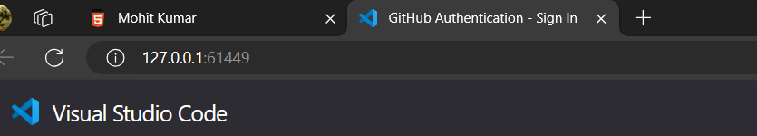

# HTML
## FORM

```
<form action="https://httpbin.org/get">
    <label for="firstName">First Name:</label>
    <input type="text" name="firstName" id="firstName" placeholder="Rock" autocomplete="on" required autofocus>
</form>
```
### action attribute 
action attribute added to the form tag and what we want to put here is where we're sending the information usually this would be to our own server but for this tutorial and just to demonstrate what a form does we're going to send it to a website that will display the information that we have sent with the form 

### method attribute
method will be get or post

## https://httpbin.org/
https://httpbin.org
Webhttpbin.org is a website that allows you to test different HTTP methods, auth methods, status codes, request and response data, and more. You can run it locally with docker or

### Name and id attribute in input
id is the one that absolutely needs to match the value of the four in the label this name attribute though is how it is identified at the server level so when we send this information onto the server the information that is in this input will be labeled with the value that we put in the name attribute so

### placeholder
placeholder now this lets us display text but it's not the same as the value which would actually be what the user enters so this could just be an example i'll type the name Rock and save and now we see Rock in the text input but it will not be sent with the form if we click in that input and then start to type jane disappears and now we have a value an actual value entered but as soon as i delete the last letter Rock will reappear so placeholder is just exactly that it is holding the place of whatever value will be put  in so oftentimes there is example data in there just to show the user what is expected

### autocomplete
autocomplete doesn't expect a yes or no or true or false like others often do with attributes as far as that goes this is expecting an on or off so we're going to turn the autocomplete on and that means it will remember other inputs that have been entered into
2:47:42
this field and suggest those so if we were to submit the form and then fill it out again later it might suggest what we previously put in so that's a preference thing if you want to have autocomplete on or off

### type =  password
autocomplete this is not supported in password type input

### type = tel
```
<p>
<label for="password">Password:</label>
<input type="tel" name="password" id="password" placeholder="555-555-5555" pattern="[0-9]{3}-[0-9]{3}-[0-9]{4}"  required>
</p>
```
```
<p>
<label for="password">Password:</label>
<input type="tel" name="password" id="password" placeholder="5555555555" pattern="[0-9]{3}[0-9]{3}[0-9]{4}"  required>
</p>
```
it still allows you to type a hyphen or an underscore or anything else you want in this input but we're just expecting numbers and it will have to match this pattern to allow the form to be submitted 


tell does which is short for telephone so we'll leave the four attribute on the label the name attribute and the id attribute values all to phone all lower case for placeholder let's give an example here and i'm going to put 555-555-5555 and if we wanted to leave it required we could but we can add another attribute here too
2:53:20
and i'm going to press enter just to come down a line for this it is the pattern attribute now the pattern attribute supports regular expression patterns and that's almost like learning another programming language if you're not familiar i'll at least show you this one that will give a pattern for a phone number like we have shown in the placeholder so we're saying zero to nine so this must only be numerical digits and then we'll use a curly brace and put the number three so it should
2:53:52
be three numerical digits then we'll put the dash and now i'm going to put the same pattern again because we had three more and another dash and then finally it's going to be the same pattern again because we want all numbers and only numbers but this last one should be four and so that is a regular expression pattern that would match what you see here for the example now why else would we put the type tell instead of type text or type number well type number has a little different display and it actually provides arrows that would have you click up and down we don't want that
2:54:30
but type tell also on mobile devices should bring up a numeric keypad on the screen instead of an alpha numeric essentially with letters it should just bring up what you would say dial for a phone number and now that i'm thinking about that the hyphen might not be available on that numeric pad so let's just make it simpler and go with all numbers here and remove those hyphens from our pattern too so it can still match 

## selection
##selection

##option 

### optgroup -  
optgroup element we can put in here to help organize our selections
optiongroup

label attribute different than label element 
```
<optgroup label="Coffees">
    <option value="regular coffee">Regular Coffee</option>
    <option value="iced coffee">Iced Coffee</option>
</optgroup>
```


## required
```
required
```
no need to use
it will by default like below code
```
required="true"
```
we have no need to use the below 
```
required = "false"
```
required and this will require this field to have information from the user before the form can be submitted now notice i said autocomplete didn't use true or false or yes or no required does but we don't really have to set it equal to true like this we can just say required because if we put required there it equals true and then
2:48:20
if we don't have required there it's obviously false 

### autofocus
autofocus now only one element in the form or on the page can actually have autofocus because it can't focus on more than one at once this will put the focus in that input when the page loads 

if we reload the page we should see the flashing cursor here there's focus in there immediately when the page loads so we can start typing instantly when the page loads in that field

##
different type of input that can handle very similar data presentation 

## fieldset and legend
it's got a square around it and personal info the legend is part of that frame of this section of the form and clearly this does give some more semantic meaning actually conveys meaning in our structure as we define part of the form and what it's about

when a form gets large sometimes it's good to organize it into different sections sections that say what each part of the form 

because this will be a section where we've asked about the different information such as the name and your favorite coffee and so on and now inside of this field set we can specify one more element and this is called **legend** it's a lot like a caption and this is just saying what we're requesting in this section of the form and i'll put personal info here 

and then we can save now let's go back and look at our form again and you can see it's surrounded this section of the form because we're going to add more to it yet so we just sectioned off part of our form essentially

## type = radio
### name = "same"
when we select one the other choice should not be selected and that's what we achieve by giving them all the same name for the input 

### id
i should note that if we had an id of other we didn't with our option up here that was separate that had just the value of other as far as the option and the name and the id was coffee so we're good but you don't want to double up you want to make sure you have individual or unique ids for each input in your form

we can't have an id that says other here too we would be doubling up on that so that could be a problem let's say and select all three and say otherPet 

## textarea
if we write anything between the textarea that will be value It's better to use placeholder

you commonly see on a contact us form you might have a area for the email for a different message and so on but this would be where you would typically type a paragraph a

## button
a button element should have a type we'll set that equal to submit note you might also see a form that has a type and here we should put submit there we go so you might see an input with a type submit and that can also create a button the main difference here is that it only takes a text value and that's what will show up on the button inside of a button element you could actually put more things than just a text value inside of the button element so that that is a big difference i like to use the button elements overall because once again it's a little more semantic here we're saying it's a button and then we can just set the type to a submit button so here inside of the button i'm going to type submit and that's what will show up on the button

## password
we went back the information is in all of these other fields but it's not in the password field we would have to re-enter that every time and that's just part of being with the password field 


```
Github Authentication Port Number
61449
```